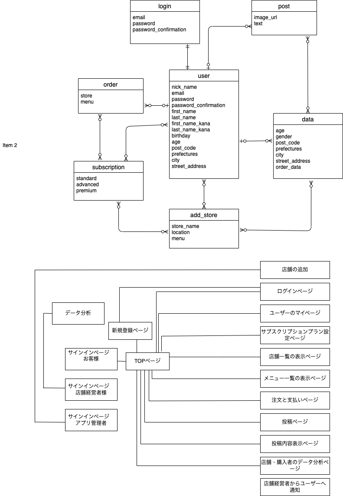

# アプリケーション名
デイリー（Daily）

## アプリケーション概要
1. "デイリー"は、飲食店などの、店舗経営者、消費者向けのアプリケーションで、店舗経営者がサブスクリプションプランを導入することにより、安定して集客を行い売り上げを伸ばすことができます。
2. 集客に困っている経営者の課題を解決します。
3. サブスクリプションを契約したユーザーと店舗を繋ぎます。
4. 顧客が毎回の支払いを気にすることなくメニューを注文し、楽しむことができます。
5. 飲食店オーナーはユーザーの分析データからメニューなどを設定し、顧客を魅了することができます。

## URL
デプロイ済みのURL: https://every-skt5.onrender.com/

## 利用方法
1. ユーザー登録をしてください。
2. アプリにログインします。
3. サブスクリプションで提供されているメニューを閲覧します。
4. お気に入りのメニューを選択し、注文します。
5. 支払いを行います。
6. メニューが提供される時間に店舗でサービスを利用してください。

## アプリケーションを作成した背景
"デイリー"アプリは、飲食店などの店舗経営者が顧客を引き寄せるためにサブスクリプションのメニューを提供するのを支援することを目的としています。
クリーニング店などその他店舗経営者にも利用を想定しています。
また、このアプリを通じて、新たなユーザーを獲得し、店舗経営者と顧客の両方にとって簡便な方法を提供します。

## 洗い出した要件
要件定義スプレッドシート: https://docs.google.com/spreadsheets/d/1DmAC0S1lFgQdcOMTgE4R8WU3USMXFzX9eeUPeAa-3ac/edit?usp=sharing

## 実装した機能

### サブスクリプションプラン設定
- 飲食店オーナー（店舗経営者）が毎日のメニューを設定できます。内容によって週に１回、月に１回など設定できます。
- 各メニューには価格と提供時間帯が含まれます。

### メニュー表示
- ユーザーは提供されているサブスクリプションメニューを閲覧できます。

### 注文と支払い
- ユーザーはアプリを介してサブスクリプションメニューを注文し、支払いを行います。

### ログイン
- ログインして購入した商品について投稿できます。

### ログアウト
- ログアウトするとトップページに戻ります。

### 投稿
ログインしたお客様が商品についての画像とコメントを投稿できます。
新しい投稿は上部に表示されます。

### 投稿内容について詳細表示、編集、削除の表示
ログインしている投稿者には投稿内容について詳細、編集、削除が表示されます。

### 投稿内容について詳細表示
ログインしている投稿者は詳細表示、編集、削除ができます。

詳細表示

編集

削除

## 実装予定の機能
- 購入機能
- 店舗の追加機能
- 店舗、ユーザーの投稿機能
- データ分析と洞察の提供
- 店舗オーナーから顧客への通知機能
- 広告収益を得るための広告表示
- サブスクリプションプランの導入
- ブランド提携のサポート

## データベース設計
[ER図]

## 画面遷移図
[画面遷移図]

## 開発環境
- Ruby on Rails
- PostgreSQL データベース
- HTML, CSS, JavaScript

## ローカルでの動作方法
以下のコマンドを順に実行。
% git clone https://github.com/ayumi0511
% cd every
% bundle install
% yarn install

## 工夫したポイント
このアプリではシンプルなユーザーインターフェースと使いやすさに重点を置きました。
また、顧客と店舗オーナーの双方に価値を提供できるような機能を開発できるように注力しました。

## 改善点
将来的には、データ分析と洞察を提供するための機能を強化し、より多くの店舗オーナーに価値を提供できるようにする予定です。

# テーブル設計

Users テーブル:

| Column	                | Type	    | Options       |
|-------------------------|-----------|---------------|
| nick_name               |	 string   |               |	
| email                   |	 string	  |               |
| password	              |  string	  |               |
| password_confirmation	  |  string	  |               |
| first_name	            |  string	  |  null: false  |
| last_name	              |  string	  |  null: false  |
| first_name_kana	        |  string	  |               |
| last_name_kana	        |  string	  |               |
| birthday                | 	date    |             	|
| age	                    |  integer  |               |
| post_code	              |  string	  |               |
| prefectures	            |  string	  |               |
| city	                  |  string	  |               |
| street_address          |  string	  |               |

Association:
has_one :subscription
has_many :orders

Subscription テーブル:

| Column                  |	Type      |	Options       |
|-------------------------|-----------|---------------|
| standard                | boolean	  |               |
| advanced                | boolean	  |               |
| premium                 |	boolean	  |               |

Association:
belongs_to :user

Order テーブル:

| Column                  | Type      |	Options       |
|-------------------------|-----------|---------------|
| store                   |	string    |               |
| menu                    | string    |               |

Association:
belongs_to :user

Login テーブル:

| Column                  | Type      |	Options       |
|-------------------------|-----------|---------------|
| email                   | string    |               |
| password                | string    |               |
| password_confirmation   |	string    |               |

Post テーブル:

| Column                  | Type      | Options       |
|-------------------------|-----------|---------------|
| image_url               | string    |               |
| text                    | text      |               |

Add_store テーブル:

| Column                  | Type      | Options       |
|-------------------------|-----------|---------------|
| store_name              | string    |               |
| location                | string    |               |
| menu                    | string    |               | 

Data テーブル:

| Column                  | Type      | Options       |
|-------------------------|-----------|---------------|
| age	                    | integer   |               |
| gender                  | string    |               |
| post_code               | string    |               |
| prefectures             | string    |               |
| city                    | string    |               |
| street_address          | string    |               |